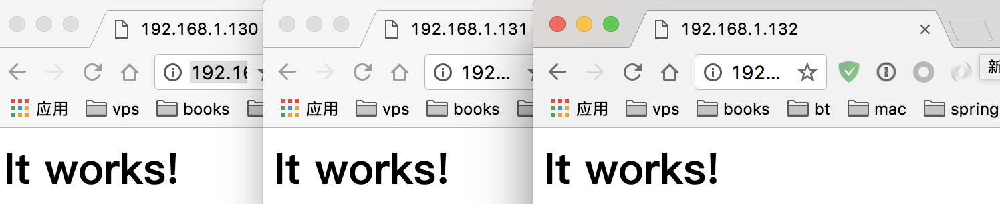

Docker swarm是集群下docker容器编排工具，本文讲解了安装swarm的步骤和swarm界面管理工具Portainer的安装。

本文使用的操作是CentOS7；三台主机，一台作为管理节点，另外两台作为工作节点。

### 1.安装swarm


- 编辑三台机器的`/etc/hosts`文件，内容修改为：

  ​

  ```shell
  192.168.1.130    manager.wisely.com   manager
  192.168.1.131    node1.wisely.com     node1
  192.168.1.132    node2.wisely.com     node2
  ```

  ​

- 每台机器安装docker，顺序执行下面命令

  ​

  ```Shell
  yum update -y
  yum install docker
  systemctl start docker
  systemctl enable docker
  ```

  ​

- 每台机器开放下面防火墙端口，顺序执行下面命令：

  ​

  ```shell
  firewall-cmd --permanent --add-port=2376/tcp
  firewall-cmd --permanent --add-port=2377/tcp
  firewall-cmd --permanent --add-port=7946/tcp
  firewall-cmd --permanent --add-port=7946/udp
  firewall-cmd --permanent --add-port=4789/udp
  firewall-cmd --permanent --add-port=80/tcp
  firewall-cmd --reload
  systemctl restart docker
  ```

  ​

- 在manager节点初始化集群：

  ​

  ```shell
  docker swarm init --advertise-addr 192.168.1.130
  ```

  ​

  执行后，得到下面结果：

  ​

  ```shell
  Swarm initialized: current node (b0389cuqtk1h2v5vhj3a3xurz) is now a manager.

  To add a worker to this swarm, run the following command:

      docker swarm join \
      --token SWMTKN-1-2xinda2i8kc8is6eob7hhyqyntxal1688ixzep2dqpmkyktnio-4xub9o40ilq326yi6b0hnjx9f \
      192.168.1.130:2377

  To add a manager to this swarm, run 'docker swarm join-token manager' and follow the instructions.
  ```

  ​

- 在另外两个工作节点执行：

  ​

  ```shell
  docker swarm join \
      --token SWMTKN-1-2xinda2i8kc8is6eob7hhyqyntxal1688ixzep2dqpmkyktnio-4xub9o40ilq326yi6b0hnjx9f \
      192.168.1.130:2377
  ```

  ​

  输出为：

  ​

  ```shell
  [root@localhost ~]# docker swarm join \
  >     --token SWMTKN-1-2xinda2i8kc8is6eob7hhyqyntxal1688ixzep2dqpmkyktnio-4xub9o40ilq326yi6b0hnjx9f \
  >     192.168.1.130:2377
  This node joined a swarm as a worker.
  ```

  ​

- 执行`docker node ls`查看集群信息:

  ​

  ```Shell
  ID                           HOSTNAME            STATUS  AVAILABILITY  MANAGER STATUS
  0bd7q219yihhkrlbj2prhlmxu    node1.wisely.com    Ready   Active        
  0qm0up69sjld7rwofso506oml    node2.wisely.com    Ready   Active        
  b0389cuqtk1h2v5vhj3a3xurz *  manager.wisely.com  Ready   Active        Leader
  ```

  ​

- 使用阿里云docker镜像加速，按顺序执行，请去阿里云申请：

  ​

  ```Shell
  sudo mkdir -p /etc/docker

  sudo tee /etc/docker/daemon.json <<-'EOF'
  {
    "registry-mirrors": ["https://*.mirror.aliyuncs.com"]
  }
  EOF

  sudo systemctl daemon-reload

  sudo systemctl restart docker
  ```

  ​

- 部署测试，在管理节点执行：

  ​

  ```shell
  docker service create -p 80:80 --name webserver --replicas 5 httpd
  ```

  ​

  查看集群中的service`docker service ls`：

  ​

  ```shell
  ID            NAME       REPLICAS  IMAGE  COMMAND
  7wk5kekwkyjd  webserver  5/5       httpd  
  ```

  ​

  查看集群中的webserver服务`docker service ps webserver`:

  ​

  ```shell
  ID                         NAME         IMAGE  NODE                DESIRED STATE  CURRENT STATE             ERROR
  5jq6c649y7kfdofhc8t4od7jc  webserver.1  httpd  node1.wisely.com    Running        Preparing 38 seconds ago  
  80ijfnq17p2h8dvipaabq3j4l  webserver.2  httpd  node1.wisely.com    Running        Preparing 38 seconds ago  
  94yrknng8y9e4h9l80ractm2r  webserver.3  httpd  manager.wisely.com  Running        Preparing 38 seconds ago  
  3ctowh4uctuh8q5u7lr930e9p  webserver.4  httpd  node2.wisely.com    Running        Preparing 38 seconds ago  
  du0eoe5nn9dpcvqik0z4m2ros  webserver.5  httpd  node2.wisely.com    Running        Preparing 38 seconds ago  
  ```

  ​

  访问http://192.168.1.130、http://192.168.1.131或http://192.168.1.132，结果为：

  ​

  

### 2.安装Portainer

- 首先关闭selinux，`setenforce 0`

  ​


- 在manager节点执行：

  ​

  ```shell
  docker service create \
  --name portainer \
  --publish 9000:9000 \
  --constraint 'node.role == manager' \
  --mount type=bind,src=/var/run/docker.sock,dst=/var/run/docker.sock \
  portainer/portainer \
  -H unix:///var/run/docker.sock
  ```

  ​

- 访问http://192.168.1.130:9000

  ​

  