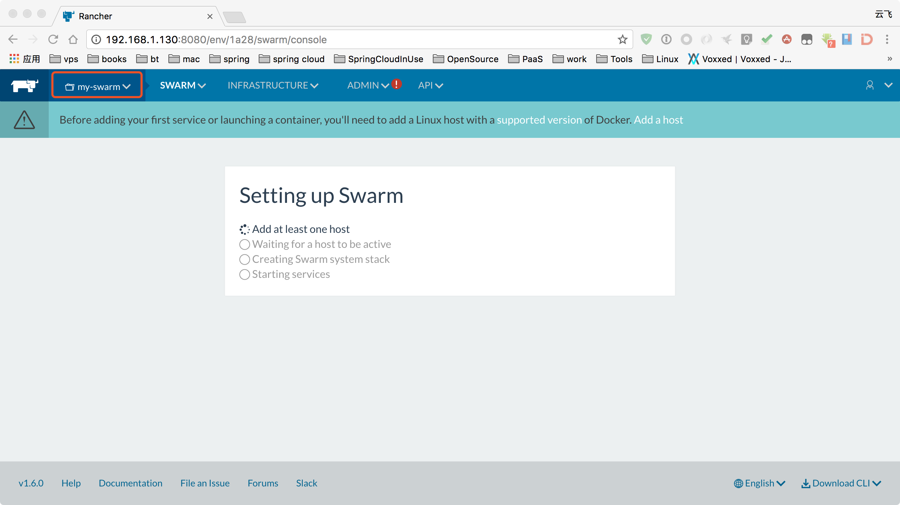

### 1.安装Rancher Server

- 在三台centos7机器(192.168.1.130，192.168.1.131，192.168.1.132)上安装docker

  ```Shell
  curl https://releases.rancher.com/install-docker/1.12.sh | sh
  ```

  ​

- 运行Rancher Server镜像

  ```Shell
  docker run -d --restart=unless-stopped -p 8080:8080 rancher/server
  ```

- 访问 http://192.168.1.130:8080 :

  


### 2.添加Swarm环境

- 菜单上点击`Default`->`Manage Environments`，界面上点击`Add Environment`

  


- 切换到`Swarm Environment`:

  

### 3.添加工作主机

- 点击页面上的`add a host`链接：


- 在工作主机(192.168.1.131,192.168.1.132)上开启udp端口：

  ```shell
  firewall-cmd --permanent --add-port=500/udp
  firewall-cmd --permanent --add-port=4500/udp
  firewall-cmd --reload
  systemctl restart docker
  ```

  ​

- 将上面的的Rancher agent容器运行命令到192.168.1.131,192.168.1.132中执行：

  ```shell
  sudo docker run -e CATTLE_AGENT_IP="192.168.1.131"  --rm --privileged -v /var/run/docker.sock:/var/run/docker.sock -v /var/lib/rancher:/var/lib/rancher rancher/agent:v1.2.2 http://192.168.1.130:8080/v1/scripts/7D3F4EA1B1F80B673A78:1483142400000:DalBJ01X1g2fLGo70TICWrPPCfs
  ```

  ```shell
  sudo docker run -e CATTLE_AGENT_IP="192.168.1.132"  --rm --privileged -v /var/run/docker.sock:/var/run/docker.sock -v /var/lib/rancher:/var/lib/rancher rancher/agent:v1.2.2 http://192.168.1.130:8080/v1/scripts/7D3F4EA1B1F80B673A78:1483142400000:DalBJ01X1g2fLGo70TICWrPPCfs
  ```

- 此时`INFRASTUCTURE`->`Hosts`下，成功添加了两台主机：


- 此时查看Swarm的设置进度

  